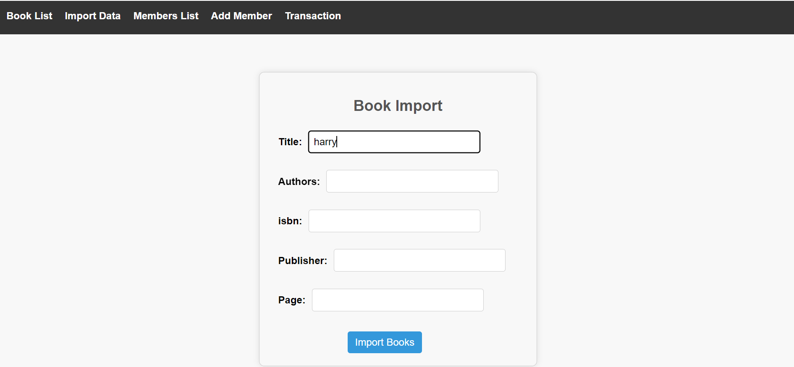
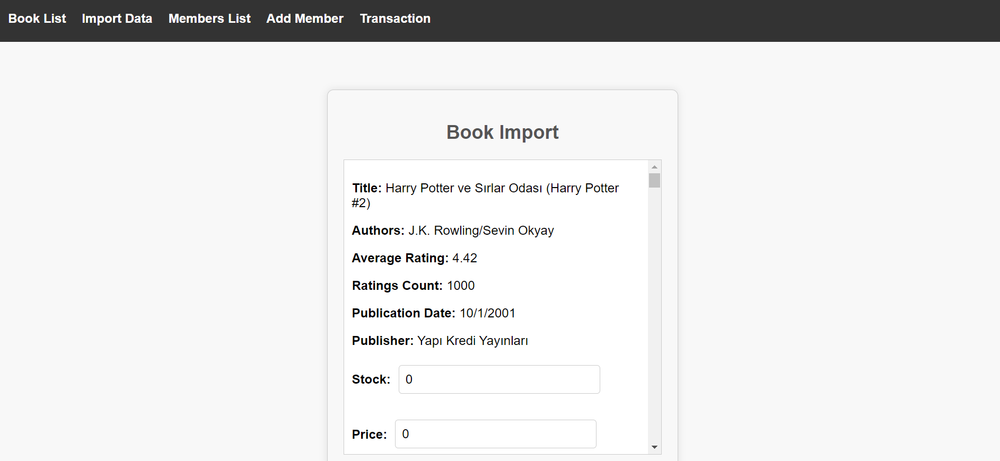
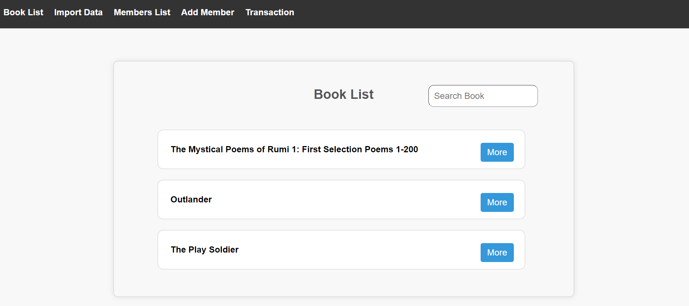
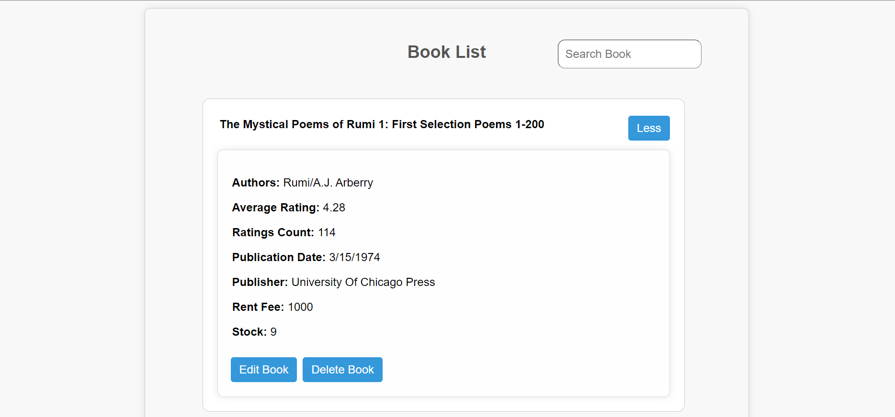
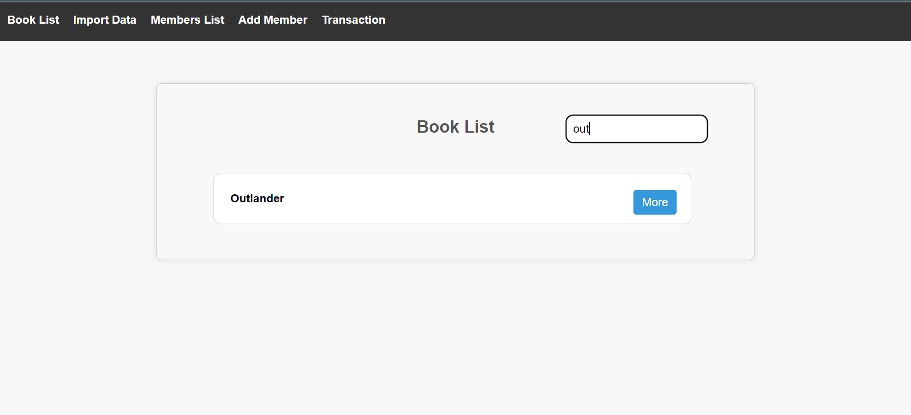
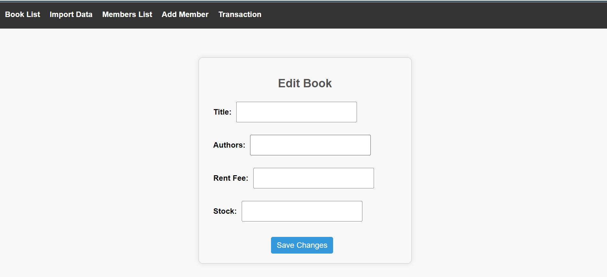
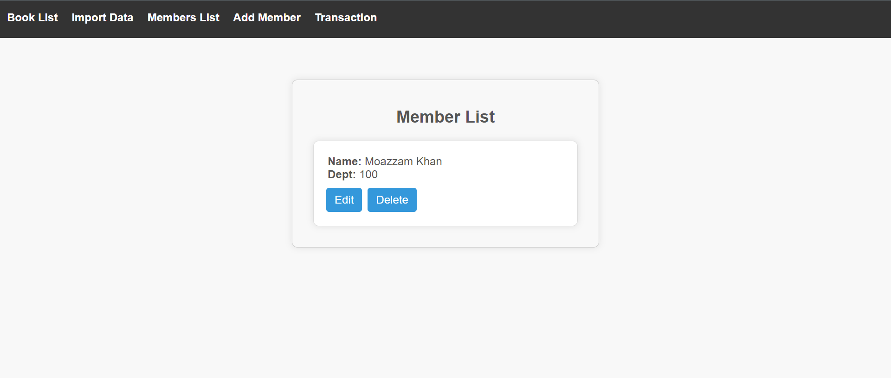
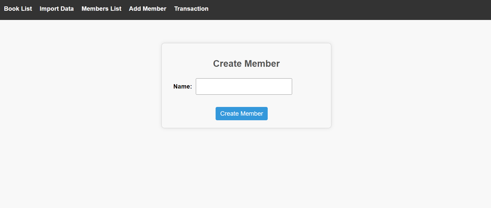
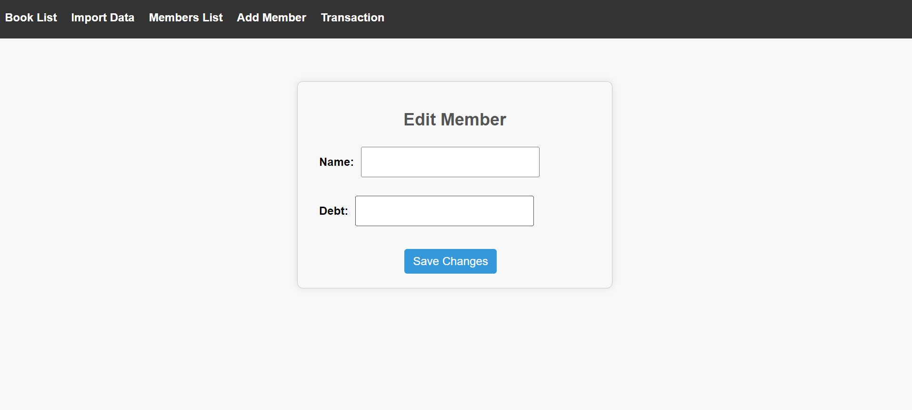
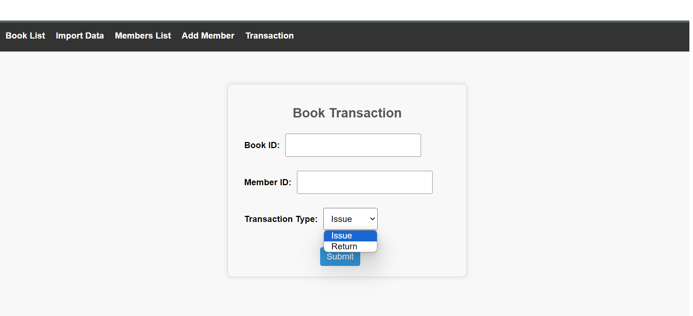

# Library Management System

This is a simple Library Management System implemented using React for the frontend and Flask for the backend.

## Features
```bash
- View a list of books
- Add new books to the library
- Search books based on title
- Update, delete books from the library
- Add new member
- Update, delete member from the system
- Issue a book to a member
- Return the issued book from the member
```

## Technologies Used
```bash
- Frontend: React
- Backend: Flask (Python)
- Database: SQL
```
## Screenshots

### Import Books





### Book List



### Book Details



### Book Search



### Edit Book



### Member List



### Add Member



### Edit Member



### Book Transaction

